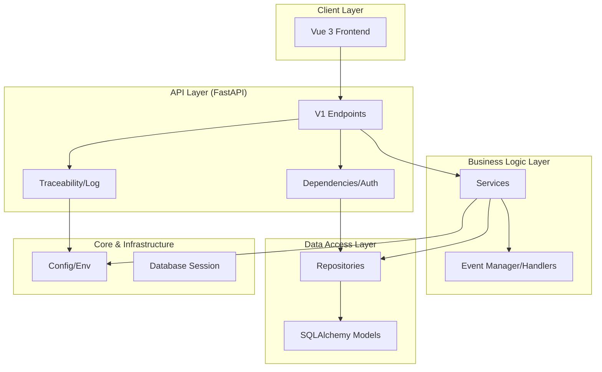
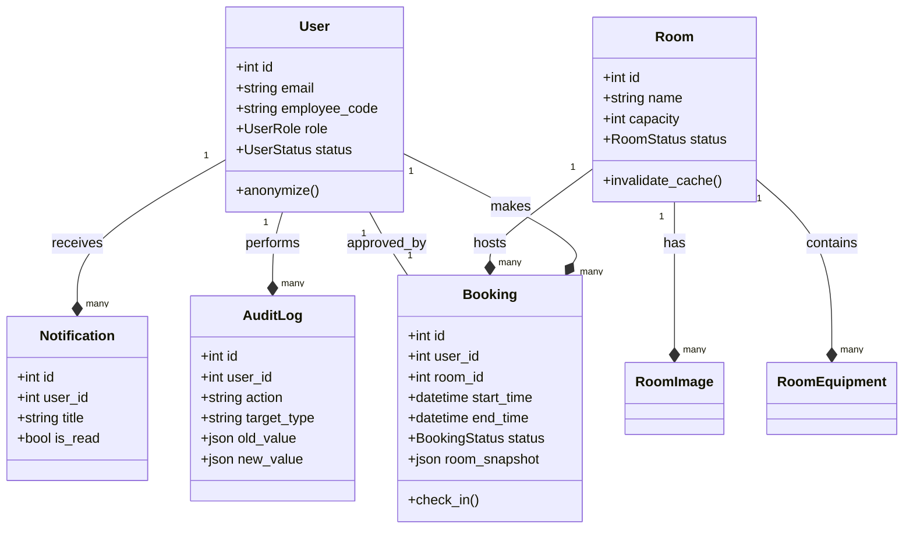

# 🏗️ P6BookingMe System Architecture (UML)

หน้านี้บรรจุแผนผัง UML เพื่อช่วยในการทำความเข้าใจโครงสร้างระบบและการ Debug

## 1. Package Diagram (System Layout)
แสดงโครงสร้างโฟลเดอร์และความสัมพันธ์ของแต่ละ Layer (4-Layer Architecture)

---

## 2. Class Diagram (Core Models)
แสดงความสัมพันธ์ระหว่างข้อมูลหลักในระบบ เพื่อช่วยในการไล่ Logic ของ Database

## 💡 ประโยชน์ในการ Debug:
1. **Circular Import Check**: หากมีการลากเส้นวนกลับใน Package Diagram ให้สงสัยว่าอาจเกิดปัญหา Circular Import
2. **Orphaned Data**: ช่วยให้เห็นความสัมพันธ์เพื่อตั้งค่า Cascade Delete ได้ถูกต้อง
3. **Event Trace**: อธิบายการไหลของข้อมูลจาก Service ไปยัง Event Handler โดยไม่ต้องผ่าน API โดยตรง
