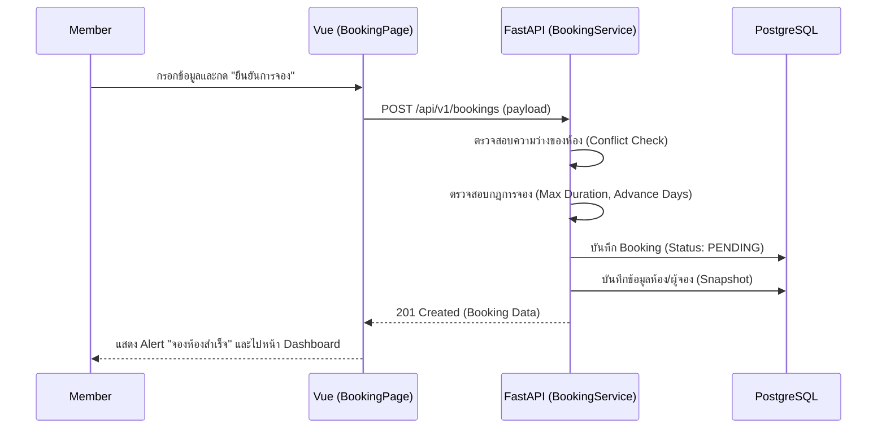
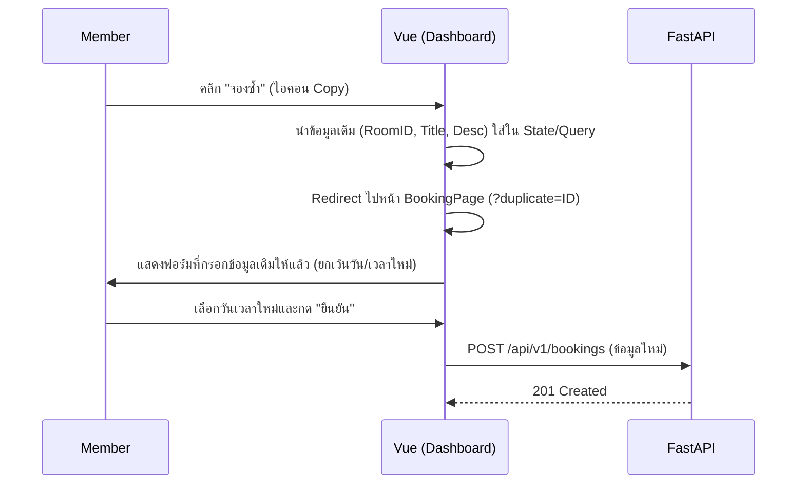
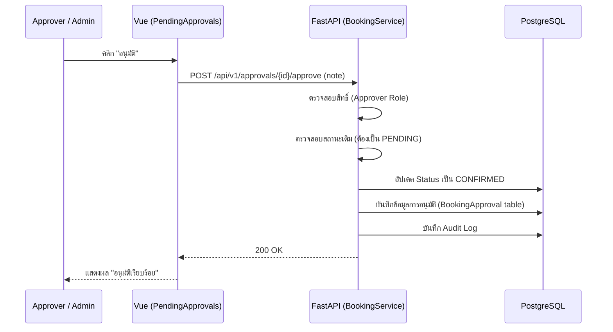
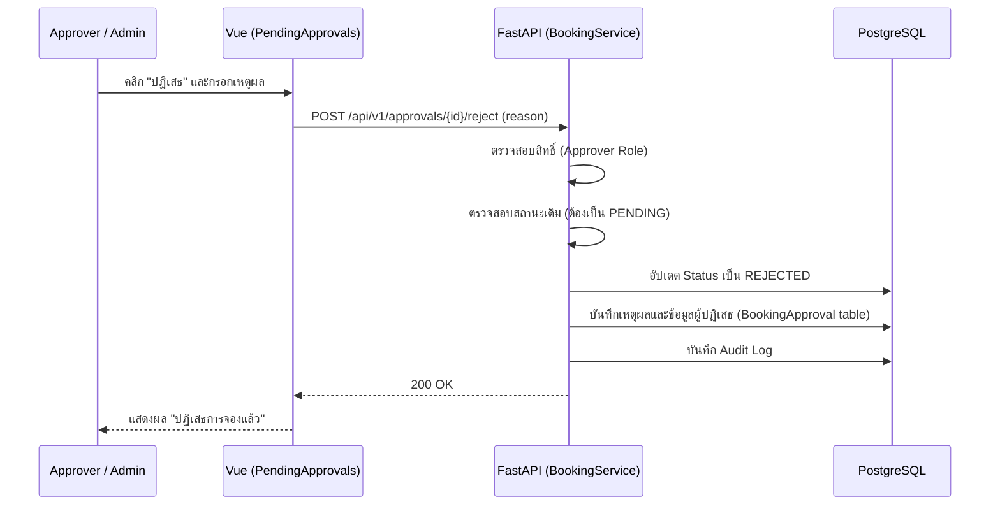

# Member Use Cases — Sequence Diagrams & Audit

เอกสารฉบับนี้อธิบายกระบวนการทำงาน (Logic Flow) ของ Use Cases หลักสำหรับ Actor: Member เพื่อยืนยันความถูกต้องของระบบ

---

## 1. M07: Create Booking (การจองห้องประชุม)

กระบวนการสร้างรายการจองใหม่ พร้อมระบบตรวจสอบเงื่อนไขและ Conflict



---

## 2. M12: Edit Booking (การแก้ไขการจอง)

ระบบความปลอดภัยระดับ Enterprise: หากแก้ไขรายการที่อนุมัติแล้ว จะต้องส่งกลับไปพิจารณาใหม่ (Status Reversion)

```mermaid
sequenceDiagram
    participant Actor as Member / Admin
    participant Frontend as Vue (Dashboard/BookingPage)
    participant Backend as FastAPI (BookingService)
    participant DB as PostgreSQL

    Actor->>Frontend: คลิก "แก้ไข" (ส่ง Query ?edit=ID)
    Frontend->>Backend: GET /api/v1/bookings/{id}
    Backend-->>Frontend: ข้อมูลการจองเดิม
    Frontend->>Actor: แสดงฟอร์มพร้อมข้อมูลเดิม (Pre-fill)
    Actor->>Frontend: แก้ไขข้อมูลและกด "บันทึก"
    Frontend->>Backend: PATCH /api/v1/bookings/{id} (updated data)
    Backend->>Backend: ตรวจสอบสิทธิ์ (Owner หรือ Admin)
    Backend->>Backend: ตรวจสอบ Conflict ใหม่
    Note over Backend: หากเดิมคือ CONFIRMED และคนแก้ไม่ใช่ Admin
    Backend->>Backend: เปลี่ยน Status กลับเป็น PENDING ⚠️
    Backend->>DB: อัปเดตข้อมูลใน Database
    Backend-->>Frontend: 200 OK
    Frontend-->>Actor: แสดงผล "แก้ไขสำเร็จ"
```

---

## 3. M13: Quick Re-book (การจองซ้ำด่วน)

ระบบอำนวยความสะดวกโดยการคัดลอกข้อมูลเดิมมาเป็นต้นแบบ



---

## 4. M14: Cancel Booking (การยกเลิกการจอง)

รองรับทั้งเจ้าของรายการ (Member) และผู้ดูแลระบบ (Admin) โดยมีระบบตรวจสอบสถานะก่อนดำเนินการ

```mermaid
sequenceDiagram
    participant Actor as Member / Admin
    participant Frontend as Vue (Dashboard)
    participant Backend as FastAPI (BookingService)
    participant DB as PostgreSQL

    Actor->>Frontend: คลิก "ยกเลิก" และยืนยัน
    Frontend->>Backend: POST /api/v1/bookings/{id}/cancel (reason)
    Backend->>Backend: ตรวจสอบสิทธิ์ (Owner หรือ Admin)
    Backend->>Backend: ตรวจสอบสถานะ (ต้องไม่ใช่ Cancelled/Rejected)
    Backend->>DB: อัปเดต Status เป็น CANCELLED
    Backend->>DB: บันทึกผู้ยกเลิก (cancelled_by)
    Backend->>DB: บันทึกเหตุผล (cancel_reason)
    Backend->>DB: บันทึก Audit Log
    Backend-->>Frontend: 200 OK
    Frontend-->>Actor: แสดงผล "ยกเลิกสำเร็จ"
```

---

## 5. A01: Approve Booking (การอนุมัติการจอง)

กระบวนการสำหรับ Approver หรือ Admin เพื่อเปลี่ยนสถานะการจองเป็น CONFIRMED



---

## 6. A02: Reject Booking (การปฏิเสธการจอง)

การปฏิเสธคำขอจองห้องประชุม พร้อมระบุเหตุผลบังคับ



---

## 🔍 สรุปผลการตรวจสอบ (Audit Result)

| หัวข้อการตรวจสอบ | สถานะ | หมายเหตุ |
|---|---|---|
| **Data Integrity** | ✅ ผ่าน | ใช้ Snapshot ป้องกันข้อมูลประวัติเพี้ยน |
| **Security (Ownership)** | ✅ ผ่าน | ตรวจสอบสิทธิ์เจ้าของรายการทุกครั้งก่อน Update |
| **Business Rules (Conflict)** | ✅ ผ่าน | เช็คเวลาซ้ำซ้อนทั้งตอนสร้างและแก้ไข |
| **UX Consistency** | ✅ ผ่าน | ใช้ระบบ Long Modal และการเปลี่ยนข้อความตาม Context |
| **Status Reversion Logic** | ✅ ผ่าน | มั่นใจว่ารายการที่ Confirm แล้วจะไม่ถูกแอบแก้ไขโดยไม่ผ่านการอนุมัติซ้ำ |
| **Server-side Processing** | ✅ ผ่าน | ย้าย Search/Filter/Pagination ไปประมวลผลที่ DB เพื่อรองรับ Scalability |
| **UI Consistency** | ✅ ผ่าน | ทุกหน้าจอ Admin และ Member ใช้มาตรฐาน ROWS/Pagination เดียวกันเป๊ะ |
