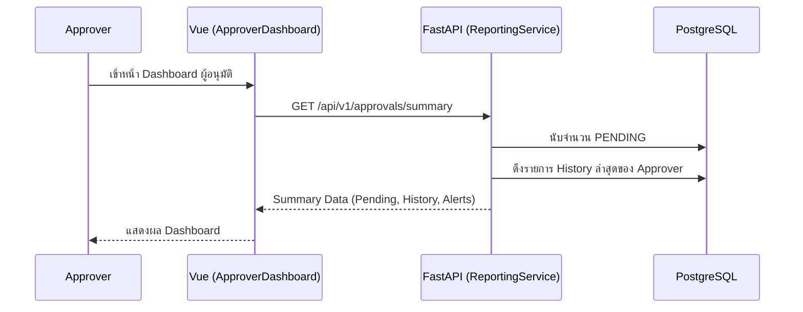

# Implementation Plan: Sprint 6.4 — Approver Experience Optimization

## Objective
ยกระดับประสบการณ์การทำงานของผู้อนุมัติ (Approver) ให้สามารถจัดการคำขอจองห้องประชุมได้อย่างมีประสิทธิภาพ รวดเร็ว และตรวจสอบย้อนหลังได้ครบถ้วน (Enterprise Workflow)

---

## 🛠 Features to Implement

### 1. Approver Dashboard (แผงควบคุมผู้อนุมัติ)
- **Objective**: ให้ข้อมูลสรุปที่จำเป็นสำหรับผู้อนุมัติทันทีที่เข้าสู่ระบบ
- **Details**:
    - สรุปจำนวนรายการที่รออนุมัติ (Pending Count)
    - รายการล่าสุดที่ตนเองพิจารณาไปแล้ว (My Recent Actions)
    - แจ้งเตือนรายการที่ค้างนานเกิน 24 ชั่วโมง (SLA Alert)

### 2. Approver Calendar View (ปฏิทินการจองสำหรับผู้อนุมัติ)
- **Objective**: ให้ข้อมูลบริบท (Context) ของการใช้ห้องในช่วงเวลาต่างๆ เพื่อช่วยในการตัดสินใจ
- **Details**:
    - ผสมผสานรายการจองที่อนุมัติแล้ว และรายการที่ "รออนุมัติ" ลงในปฏิทินเดียวกัน (แยกสีให้ชัดเจน)
    - ช่วยให้ผู้อนุมัติเห็นภาพรวมว่าหากอนุมัติรายการนี้ จะไปกระทบหรือเบียดบังรายการอื่นที่กำลังรออยู่หรือไม่

### 3. Detailed Approval History (ระบบประวัติการพิจารณาเชิงลึก)
- **Objective**: ตรวจสอบเหตุผลและการตัดสินใจในอดีตได้ละเอียดขึ้น
- **Details**:
    - เพิ่มหน้าจอแสดงรายละเอียดการอนุมัติ/ปฏิเสธ (Note, Timestamp, Actor)
    - ระบบกรองประวัติการทำงานตามช่วงเวลาและประเภทห้อง

### 3. Approver Identity Consistency
- **Objective**: ปรับปรุง UI ให้ผู้อนุมัติรู้สึกถึงบทบาทหน้าที่ (Role-based UI)
- **Details**:
    - ปรับปรุง Navigation ให้เหมาะสมกับสิทธิ์ Approver (ไม่ใช่ Admin ทั้งหมด)
    - ออกแบบ Empty States สำหรับหน้าอนุมัติให้มีความเป็น "งานเสร็จสิ้น" (Success Context)

---

## 📊 Sequence Diagrams

### 1. A03: Approver Dashboard Loading
กระบวนการรวบรวมข้อมูลสถิติสำหรับผู้อนุมัติโดยเฉพาะ

---

## 📅 Implementation Plan

### Phase 1: Backend Updates
- พัฒนา Endpoint `/api/v1/approvals/summary`
- ปรับปรุงระบบ Query ประวัติให้รองรับการ Pagination แบบ Server-side (เสร็จสิ้นใน Sprint 6.3 แล้ว แต่ต้องตรวจสอบความสมบูรณ์)

### Phase 2: Frontend Implementation
- สร้าง `ApproverDashboard.vue`
- ปรับปรุง `ApprovalHistory.vue` ให้ใช้ระบบ DataTable มาตรฐาน (ROWS selector)
- อัปเดต `router/index.ts` เพื่อรองรับหน้าใหม่สำหรับ Approver

---

## ✅ Success Criteria
- ผู้อนุมัติสามารถเห็นภาพรวมงานที่ค้างอยู่ได้จากหน้าแรก
- ระบบประวัติการอนุมัติทำงานแบบ Server-side 100%
- UI สอดคล้องกับมาตรฐาน Enterprise (Premium Aesthetics & Alignment)
